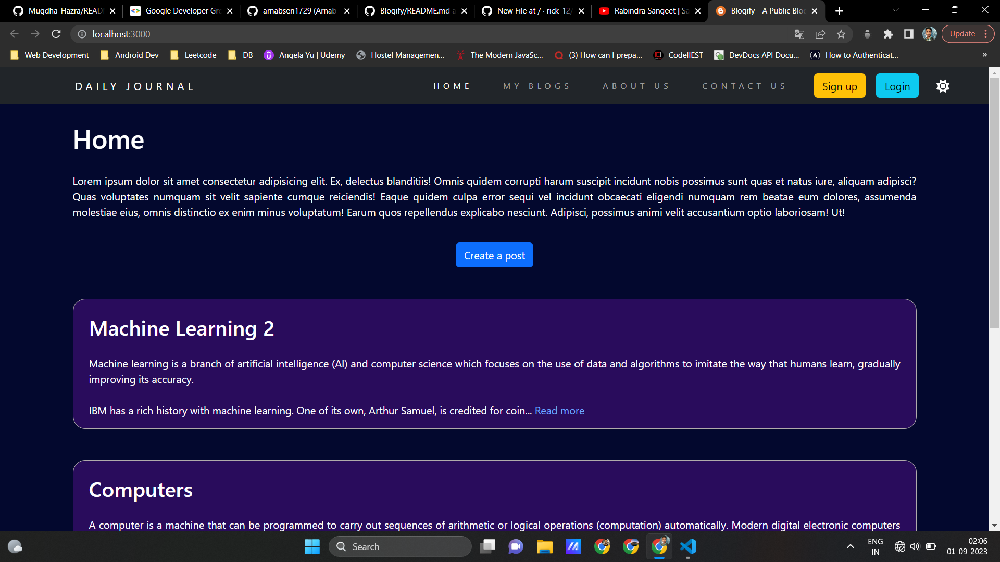
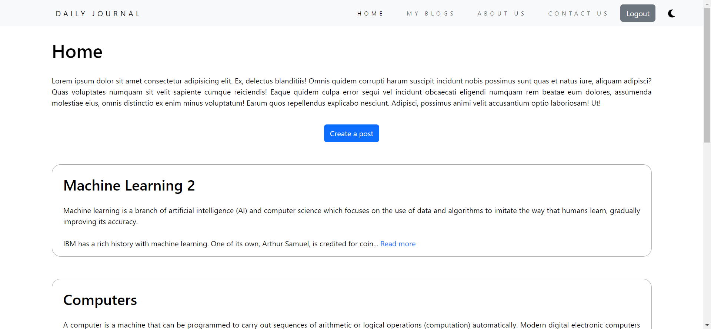
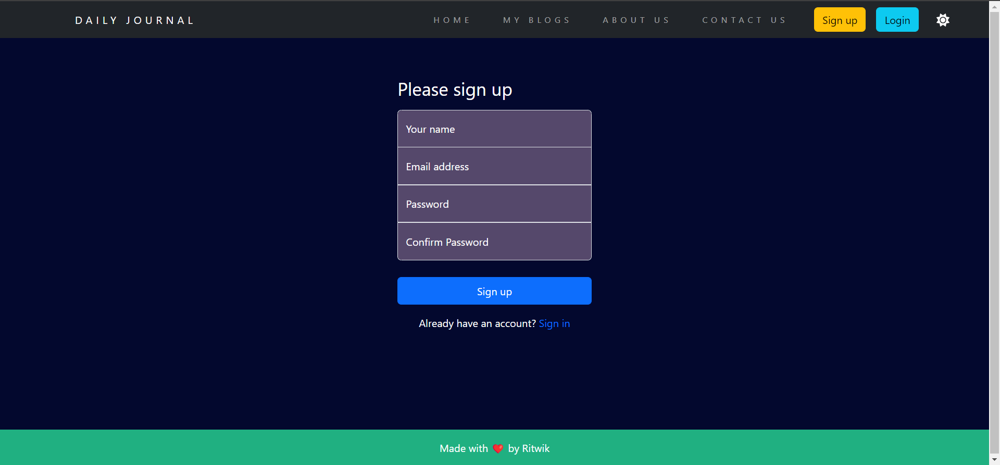
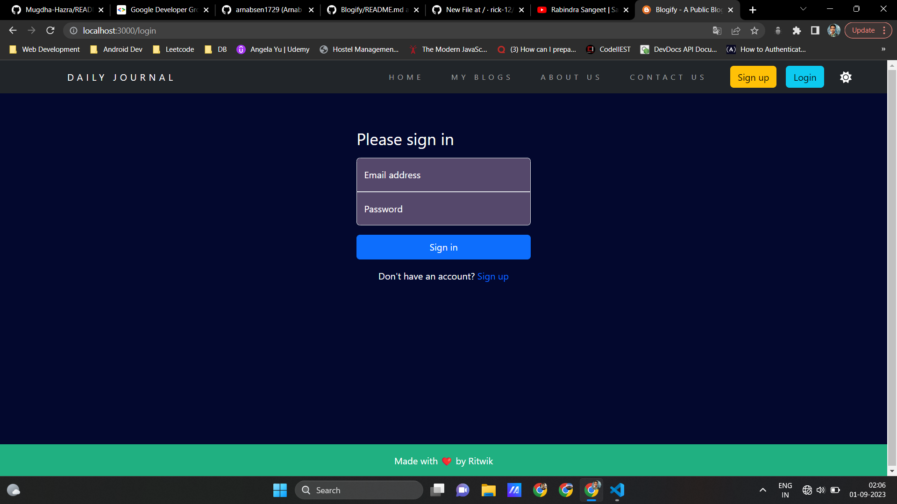
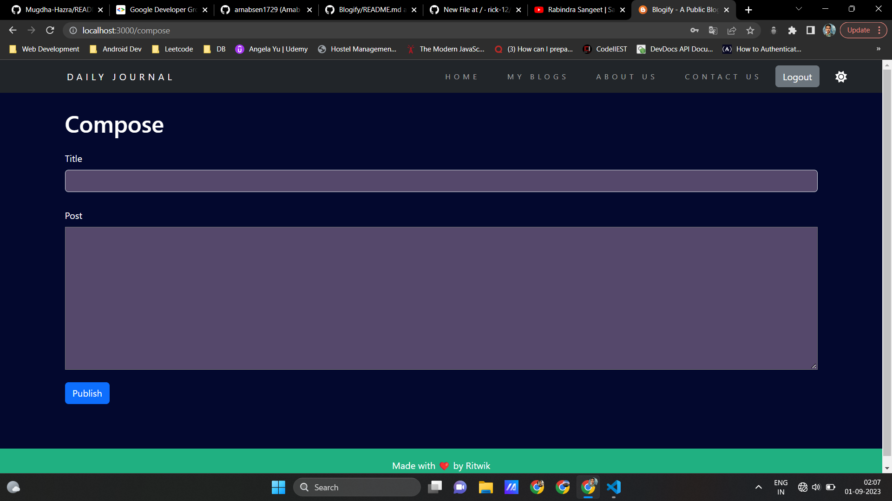
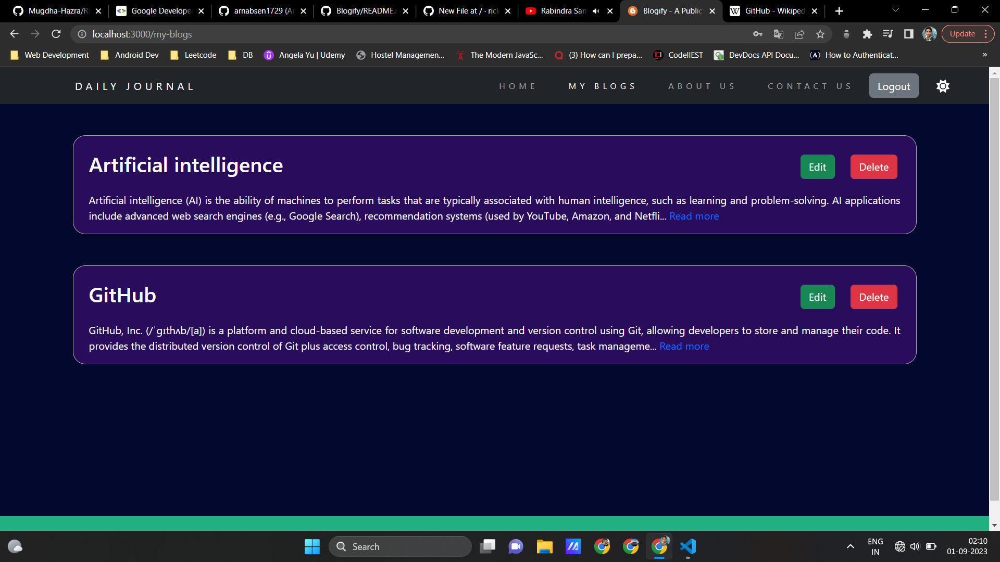
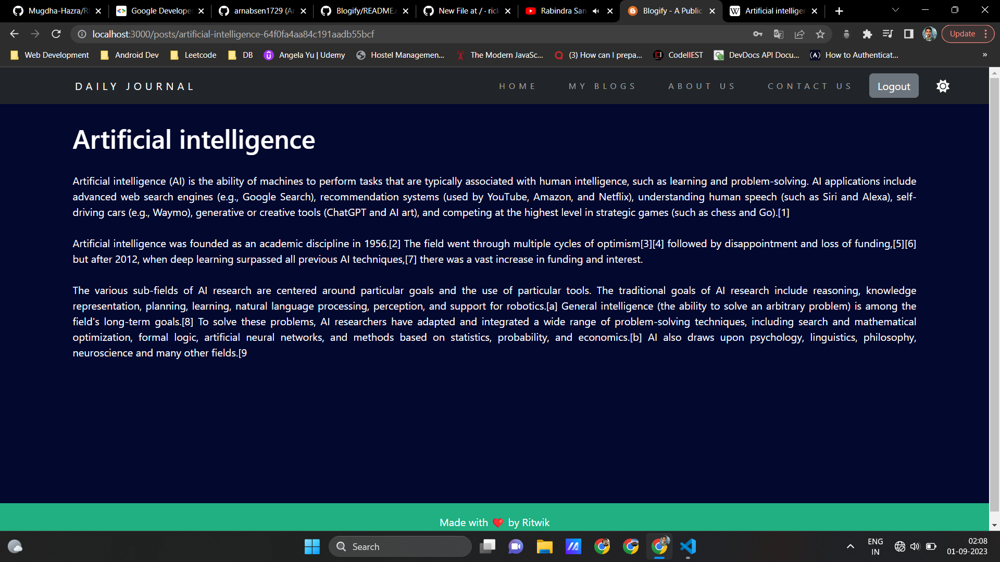

# Blogshub
On `Blogshub`, users can view blogs posted by different users all over the world. This website uses JWT authentication to register and login users into the website. Only authenticated users are allowed to compose, edit and delete their blogs.

## FRONTEND TECHNOLOGIES USED.  
---
- ReactJS.
- Bootstrap5.
  
## BACKEND TECHNOLOGIES USED.  
---
- ExpressJS
- Mongoose.
- REST APIs.


## SETUP REQUIREMENTS.  
 ---
- Copy the github repository url
- Clone to your computer
- Open terminal and navigate to the backend directory of the project
- Open another terminal and navigate to the frontend directory of the project
- Run the following command in each of the directories to install all the dependencies
 ```
npm install
```

## SCREENSHOTS OF THE APPLICATION.

- Home Page(Dark Mode)
  
  
  
- Home Page(Light Mode)
  
  

- Register Page
  
  

- Login Page
  
  

- Compose Page
  
  

- MyBlogs Page
  
   

- Readmore Page
  
  
  

## AUTHOR  
---

- [Ritwik Kundu](https://github.com/rick-12)

## COPYRIGHT.  
--- 
